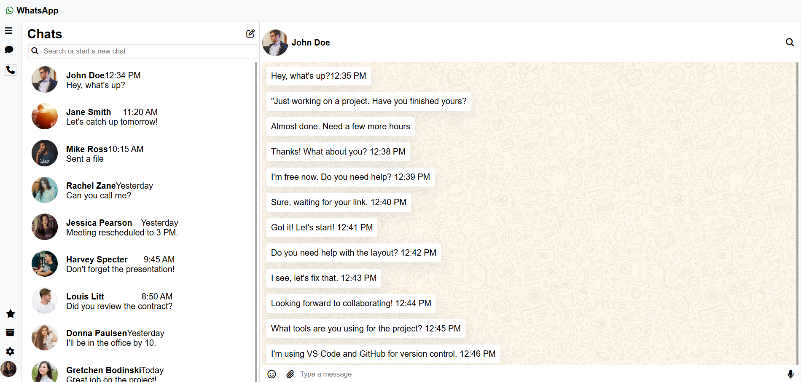

# 📱 WhatsApp UI Clone

A static UI clone of the WhatsApp Web interface built using HTML and CSS. This project replicates the design only — there is no functional backend or JavaScript.

---

## 🔧 Technologies Used

- HTML5
- CSS3

---

## 📷 Screenshot



---

## 🚀 How to Run

Just open the `index.html` file in your browser.

```bash
# On your computer:
1. Clone or download the project
2. Open the folder
3. Double-click on index.html OR open it in your preferred browser
````

---

## 📁 Folder Structure

```
whatsapp-ui-clone/
├── images/
│   └── screenshot.png       # UI screenshot
├── index.html               # Main HTML file
├── style.css                # Stylesheet
└── README.md                # Project info
```

---

## 📌 Note

This is a static UI clone for learning and portfolio demonstration purposes only. No actual functionality (like sending messages or logging in) is implemented.

---

## 🌐 Live Demo 
```
https://yourusername.github.io/whatsapp-ui-clone/
```

